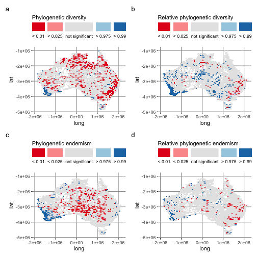
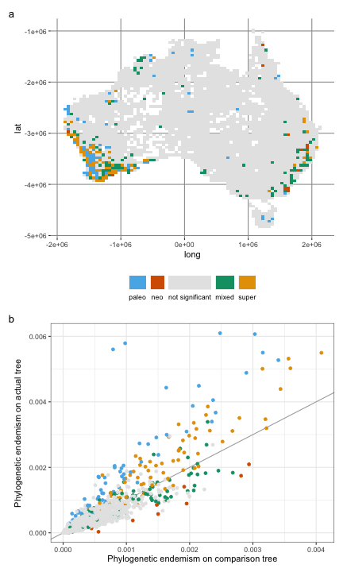

CANAPE stands for "Categorical Analysis of Neo- And Paleo-Endemism", and provides insight into the evolutionary processes underlying endemism [@Mishler2014]. The idea is basically that endemic regions may be so because either they contain range-restricted parts of a phylogeny that have unusually long branch lengths (paleoendemism), or unusually short branch lengths (neoendemism), or a mixture of both. Paleoendemism may reflect old lineages that have survived extinctions; neoendemism may reflect recently speciated lineages that have not yet dispersed. 

This vignette replicates the [analysis of Mishler et al. 2014](https://doi.org/10.1038/ncomms5473), where CANAPE was originally defined.

## Setup

Start by loading `canaper` and some other packages we will use for this vignette:


```r
library(canaper) # This package :)
library(future) # For parallel computing
library(tictoc) # For timing things
library(patchwork) # For composing mult-part plots
library(tidyverse) # For data-wrangling and plotting
```

## Dataset

The `canaper` package comes with the dataset used in @Mishler2014. Let's load the data into memory:


```r
data(acacia)
```

The `acacia` dataset is a list including two items. The first, `phy`, is a phylogeny of *Acacia* species in Australia:


```r
acacia$phy
#> 
#> Phylogenetic tree with 510 tips and 509 internal nodes.
#> 
#> Tip labels:
#>   Pararchidendron_pruinosum, Paraserianthes_lophantha, adinophylla, semicircinalis, aphanoclada, inaequilatera, ...
#> 
#> Rooted; includes branch lengths.
```

The second, `comm`, is a community dataframe with species as columns and rows as sites. The row names (sites) correspond to the centroids of 50 x 50 km grid cells covering Australia. The community matrix is too large to print out in its entirety, so we will just take a look at the first 8 rows and columns^[You might think the dataset is all zeros, but that is not the case. It is just very sparse.]:


```r
dim(acacia$comm)
#> [1] 3037  508
acacia$comm[1:8, 1:8]
#>                   abbreviata acanthaster acanthoclada acinacea aciphylla acoma
#> -1025000:-1825000          0           0            0        0         0     0
#> -1025000:-1875000          0           0            0        0         0     0
#> -1025000:-1925000          0           0            0        0         0     0
#> -1025000:-1975000          0           0            0        0         0     0
#> -1025000:-2025000          0           0            0        0         0     0
#> -1025000:-2075000          0           0            0        0         0     0
#> -1025000:-2125000          0           0            0        0         0     0
#> -1025000:-2225000          0           0            0        0         0     0
#>                   acradenia acrionastes
#> -1025000:-1825000         0           0
#> -1025000:-1875000         0           0
#> -1025000:-1925000         0           0
#> -1025000:-1975000         0           0
#> -1025000:-2025000         0           0
#> -1025000:-2075000         0           0
#> -1025000:-2125000         0           0
#> -1025000:-2225000         0           0
```

## Randomization test

There are many metrics that describe the phylogenetic diversity of ecological communities. But how do we know if a given metric is statistically significant? One way is with a randomization test. The general process is:

1. Generate a set of random communities
2. Calculate the metric of interest for each random community
3. Compare the observed values to the random values

Observed values that are in the extremes (e.g, the top or lower 5% for a one-sided test, or either the top or bottom 2.5% for a two-sided test) would be considered significantly more or less diverse than random. 

The main purpose of `canaper` is to perform these randomization tests. 

`canaper` generates random communities using the [`vegan` package](https://CRAN.R-project.org/package=vegan). There are a large number of pre-defined randomization algorithms available in `vegan`^[31 as of `vegan` v2.6.2, though not all may be applicable.], as well as an option to provide a user-defined algorithm. Selecting the appropriate algorithm is not trivial, and can greatly influence results^[For a good review of randomization algorithms and their implications for analysis results, see @Strona2018]. For details about the pre-defined algorithms, see `vegan::commsim()`.

This example also demonstrates one of the strengths of `canaper`: the ability to run randomizations in parallel^[For more information on how and when to use parallel computing in `canaper`, [see the "Parallel computing" vignette](https://docs.ropensci.org/canaper/articles/parallel.html)]. 
This is by far the most time-consuming part of CANAPE, since we have to repeat the calculations many (e.g., hundreds or more) times across the randomized communities to obtain reliable results. Here, we set the number of iterations (`n_iterations`; i.e., the number of swaps used to produce each randomized community) fairly high because this community matrix is large and includes many zeros; thorough mixing by swapping many times is required to completely randomize the matrix. 

We will use a low number of random communities (`n_reps`) so things finish relatively quickly; you should consider increasing `n_reps` for a "real" analysis^[For more information on setting the appropriate number of iterations and replicates, [see the "How many randomizations?" vignette](https://docs.ropensci.org/canaper/articles/how-many-rand.html).].
We will use the `curveball` randomization algorithm, which maintains species richness and abundance patterns while randomizing species identity [@Strona2014]^[`curveball` is similar to `swap` but runs much faster so I chose it for this large dataset.].


```r
# Set a parallel back-end, with 2 CPUs running simultaneously
plan(multisession, workers = 2)

# Uncomment this to show a progress bar when running cpr_rand_test()
# progressr::handlers(global = TRUE) # nolint

# Set a random number generator seed so we get the same results if this is
# run again
set.seed(071421)

tic() # Set a timer
# Run randomization test
acacia_rand_res <- cpr_rand_test(
  acacia$comm, acacia$phy,
  null_model = "curveball",
  n_reps = 20, n_iterations = 100000,
  tbl_out = TRUE
)
#> Warning in match_phylo_comm(phy = phy, comm = comm): Dropping tips from the tree because they are not present in the community data: 
#>  Pararchidendron_pruinosum, Paraserianthes_lophantha
toc() # See how long it took
#> 18.502 sec elapsed

# Switch back to sequential (non-parallel) mode
plan(sequential)
```

Let's take a peek at the output.


```r
acacia_rand_res
#> # A tibble: 3,037 × 55
#>    site   pd_obs pd_ra…¹ pd_ra…² pd_ob…³ pd_ob…⁴ pd_ob…⁵ pd_ob…⁶ pd_ob…⁷ pd_ob…⁸
#>    <chr>   <dbl>   <dbl>   <dbl>   <dbl>   <dbl>   <dbl>   <dbl>   <dbl>   <dbl>
#>  1 -102… 0.0145   0.0207 0.00432 -1.46         1      19      20    0.05    0.95
#>  2 -102… 0.0382   0.0522 0.00704 -1.99         0      20      20    0       1   
#>  3 -102… 0.0378   0.0371 0.00535  0.130       12       8      20    0.6     0.4 
#>  4 -102… 0.0570   0.0606 0.00758 -0.480        6      14      20    0.3     0.7 
#>  5 -102… 0.0409   0.0423 0.00836 -0.176       11       9      20    0.55    0.45
#>  6 -102… 0.00998  0.0102 0.00206 -0.0890      11       9      20    0.55    0.45
#>  7 -102… 0.0187   0.0230 0.00378 -1.14         3      17      20    0.15    0.85
#>  8 -102… 0.0434   0.0516 0.00862 -0.955        4      16      20    0.2     0.8 
#>  9 -102… 0.0111   0.0104 0.00172  0.418       17       3      20    0.85    0.15
#> 10 -102… 0.0903   0.0896 0.0114   0.0601      13       7      20    0.65    0.35
#> # … with 3,027 more rows, 45 more variables: pd_alt_obs <dbl>,
#> #   pd_alt_rand_mean <dbl>, pd_alt_rand_sd <dbl>, pd_alt_obs_z <dbl>,
#> #   pd_alt_obs_c_upper <dbl>, pd_alt_obs_c_lower <dbl>, pd_alt_obs_q <dbl>,
#> #   pd_alt_obs_p_upper <dbl>, pd_alt_obs_p_lower <dbl>, rpd_obs <dbl>,
#> #   rpd_rand_mean <dbl>, rpd_rand_sd <dbl>, rpd_obs_z <dbl>,
#> #   rpd_obs_c_upper <dbl>, rpd_obs_c_lower <dbl>, rpd_obs_q <dbl>,
#> #   rpd_obs_p_upper <dbl>, rpd_obs_p_lower <dbl>, pe_obs <dbl>, …
```

`cpr_rand_test()` produces **a lot** of columns. Here, `pd_obs` is the observed value of phylogenetic diversity (PD). Other columns starting with `pd` refer to aspects of the randomization: `pd_rand_mean` is the mean PD across the random communities, `pd_rand_sd` is the standard deviation of PD across the random communities, `pd_obs_z` is the standard effect size of PD, etc. 

For details about what each column means, see `cpr_rand_test()`.

## Classify endemism

The next step in CANAPE is to classify types of endemism. For a full description, see @Mishler2014. In short, this defines endemic regions based on combinations of the *p*-values of phylogenetic endemism (PE; `pe_obs`) and PE measured on an alternative tree with all branch lengths equal (`pe_alt`). Here is a summary [borrowed from the biodiverse blog](http://biodiverse-analysis-software.blogspot.com/2014/11/canape-categorical-analysis-of-palaeo.html), modified to use the variables as they are defined in `canaper`:

1. If either `pe_obs` or `pe_alt_obs` are significantly high then we look for paleo- or neo-endemism  
   a) If `rpe_obs` is significantly high then we have palaeo-endemism
   b) Else if `rpe_obs` is significantly low then we have neo-endemism
   c) Else we have mixed age endemism, in which case
        i) If both `pe_obs` and `pe_alt_obs` are highly significant (*p* < 0.01) then we have super endemism (high in both paleo and neo)
        ii) Else we have mixed (some mixture of paleo, neo and nonendemic)
2. Else if neither `pe_obs` or `pe_alt_obs`are significantly high then we have a non-endemic cell

`cpr_classify_endem()` carries this out automatically on the results from `cpr_rand_test()`, adding a factor called `endem_type`:


```r
acacia_canape <- cpr_classify_endem(acacia_rand_res)

table(acacia_canape$endem_type)
#> 
#>           mixed             neo not significant           paleo           super 
#>              99              12            2783              68              75
```

## Classify significance

A similar function to `cpr_classify_endem()` is available to classify significance of the randomization test, `cpr_classify_signif()`. Note that both of these take a `data.frame` as input and return a `data.frame` as output, so they are "pipe-friendly". The second argument of `cpr_classify_signif()` is the name of the biodiversity metric that you want to classify. This will add a column `*_signif` with the significance relative to the random distribution for that metric. For example, `cpr_classify_signif(df, "pd")` will add the `pd_signif` column to `df`.

We can chain them together as follows:


```r
acacia_canape <-
  cpr_classify_endem(acacia_rand_res) |>
  cpr_classify_signif("pd") |>
  cpr_classify_signif("rpd") |>
  cpr_classify_signif("pe") |>
  cpr_classify_signif("rpe")

# Take a look at one of the significance classifications:
table(acacia_canape$pd_signif)
#> 
#>          < 0.01          > 0.99 not significant 
#>             582              91            2364
```

## Visualize results

With the randomizations and classification steps taken care of, we can now visualize the results to see how they match up with those of @Mishler2014.

Note that the results will not be identical because we have used a different randomization algorithm from the paper and because of stochasticity in the random values, as well as fewer replicates for the randomization test.

Here is Figure 2, showing the results of the randomization test for PE, RPE, PE, and RPE:


```r
# Fist do some data wrangling to make the results easier to plot
# (add lat/long columns)
acacia_canape <- acacia_canape |>
  separate(site, c("long", "lat"), sep = ":") |>
  mutate(across(c(long, lat), parse_number))

theme_update(
  panel.background = element_rect(fill = "white", color = "white"),
  panel.grid.major = element_line(color = "grey60"),
  panel.grid.minor = element_blank()
  )

a <- ggplot(acacia_canape, aes(x = long, y = lat, fill = pd_signif)) +
  geom_tile() +
  # cpr_signif_cols_2 is a CVD-friendly color palette in canaper
  scale_fill_manual(values = cpr_signif_cols_2, name = "Phylogenetic diversity") +
  guides(fill = guide_legend(title.position = "top", label.position = "bottom"))

b <- ggplot(acacia_canape, aes(x = long, y = lat, fill = rpd_signif)) +
  geom_tile() +
  scale_fill_manual(
    values = cpr_signif_cols_2, name = "Relative phylogenetic diversity"
  ) +
  guides(fill = guide_legend(title.position = "top", label.position = "bottom"))

c <- ggplot(acacia_canape, aes(x = long, y = lat, fill = pe_signif)) +
  geom_tile() +
  scale_fill_manual(values = cpr_signif_cols_2, name = "Phylogenetic endemism") +
  guides(fill = guide_legend(title.position = "top", label.position = "bottom"))

d <- ggplot(acacia_canape, aes(x = long, y = lat, fill = rpe_signif)) +
  geom_tile() +
  scale_fill_manual(
    values = cpr_signif_cols_2, name = "Relative phylogenetic endemism"
  ) +
  guides(fill = guide_legend(title.position = "top", label.position = "bottom"))

a + b + c + d +
  plot_annotation(tag_levels = "a") & theme(legend.position = "top")
```



And here is Figure 3, showing the results of CANAPE:


```r
a <- ggplot(acacia_canape, aes(x = long, y = lat, fill = endem_type)) +
  geom_tile() +
  # cpr_endem_cols_4 is a CVD-friendly color palette in canaper
  scale_fill_manual(values = cpr_endem_cols_4) +
  guides(
    fill = guide_legend(title.position = "top", label.position = "bottom")
  ) +
  theme(legend.position = "bottom", legend.title = element_blank())

b <- ggplot(
  acacia_canape,
  aes(x = pe_alt_obs, y = pe_obs, color = endem_type)
) +
  geom_abline(slope = 1, color = "darkgrey") +
  geom_point() +
  scale_color_manual(values = cpr_endem_cols_4) +
  labs(
    x = "Phylogenetic endemism on comparison tree",
    y = "Phylogenetic endemism on actual tree"
  ) +
  theme_bw() +
  theme(legend.position = "none")

a + b + plot_layout(ncol = 1) + plot_annotation(tag_levels = "a")
```




## References
